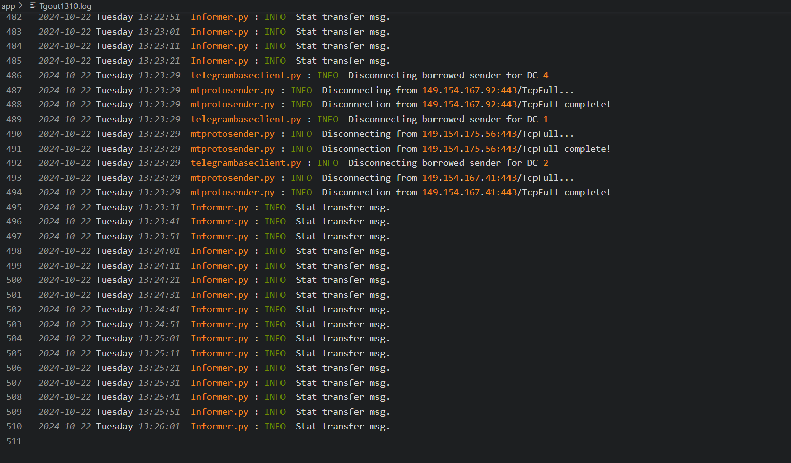

# TgCollector

> The file is going to guide you how to use TgCollector to collect the information from Telegram.
>
> **Notice:** 
> The program is a real-time monitoring of chat information. Remember to add much more activate-telegram group as possible as you can, or you would see that was typing "Start transfer msg".
> 

# Main Model:

`TgInformer.py` is the main model. It initializes all the variables and performs the preliminary work before starting the crawling process.

`TgChannel.py` is the one of the functional models of TGCollector monitoring the collection of Groups chat information.

`TgUser.py` is the one of the functional models of TGCollector monitoring the collection of Users information.

`TgMSG.py` is the one of the functional models of TGCollector monitoring the collection of Messages information.

The procedure is carried out sequentially from top to bottom

# SQL Model:

`TGMQ.py` Stores the crawled data in the form of a queue.

`TgMinIO.py` is used to store all the avatars or image content of the groups, users, and messages that have been crawled.
